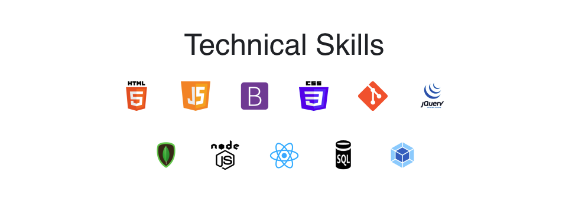

# React-Portfolio

# Table of Contents

- [Description](#description)
- [Installation](#installation)
- [Contributing](#contributing)
- [License](#license)
- [Issues](#issues)
- [Questions](#questions)

## Description:

My portfolio was made with React, Material UI, and Sass. Thanks for checking it out.

[Link to Deployed Site](https://abalcs.github.io/React-Portfolio/)

## Installation:
After cloning the repo, run `npm install` to install dependencies. Then run `npm start` to run the application locally.

## Contributing:
Please submit a pull request.

## License:
For more information about the License, click on the link below.

- [License](https://opensource.org/licenses/ISC)

##  Questions:
For questions about the app you can go to my 
Github page at the following link:

- [Github Profile](https://github.com/abalcs)

For additional questions please reach out to me via email at: abalcom23@gmail.com.
